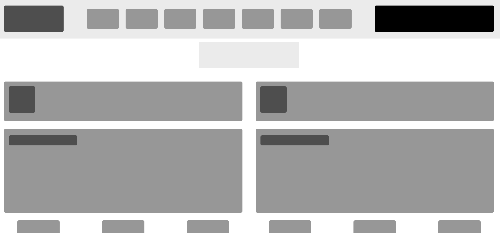

## Design teardown

</h1>This project is a design teardown of the smashing magazine website ( www.smashingmagazine.com ) showing the the most visually appealing elements with darker shades of grey. The webpage is built using html/css and css positioning technologies ( FLEX GRID FLOAT ).</h1>

## Built With

Html

CSS

Visual code

## Live Demo

[Live Demo Link](https://rawcdn.githack.com/coldatlas/design-teardown/70252253be90a372af813ab3fd6e534b93fe5e0e/index.html)

## Prerequisites

Text editor,Github profile and Git.

## Authors

👤 Mina Anwar

- Github: [@coldatlas](https://github.com/coldatlas)

- LinkedIn: [LinkedIn](https://www.linkedin.com/in/coldyatlas/)

👤 Khalil Hamdi

- Github: [@khalilhamdii](https://github.com/khalilhamdii)

- LinkedIn: [LinkedIn](https://www.linkedin.com/in/khalilhamdi/)

## 🤝 Contributing

Contributions, issues and feature requests are welcome!

Feel free to check the issues page.

Show your support
Give a ⭐️ if you like this project!

## 📝 License

This project is a collaboration project of microverse students. All rights are reserved for Mina and Khalil.
